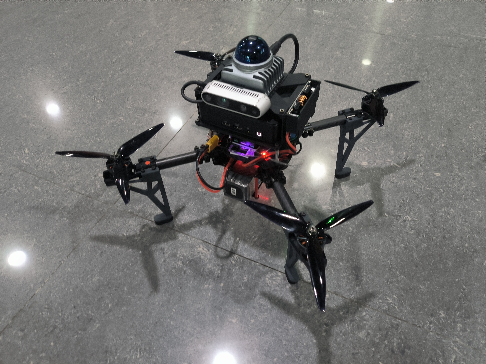
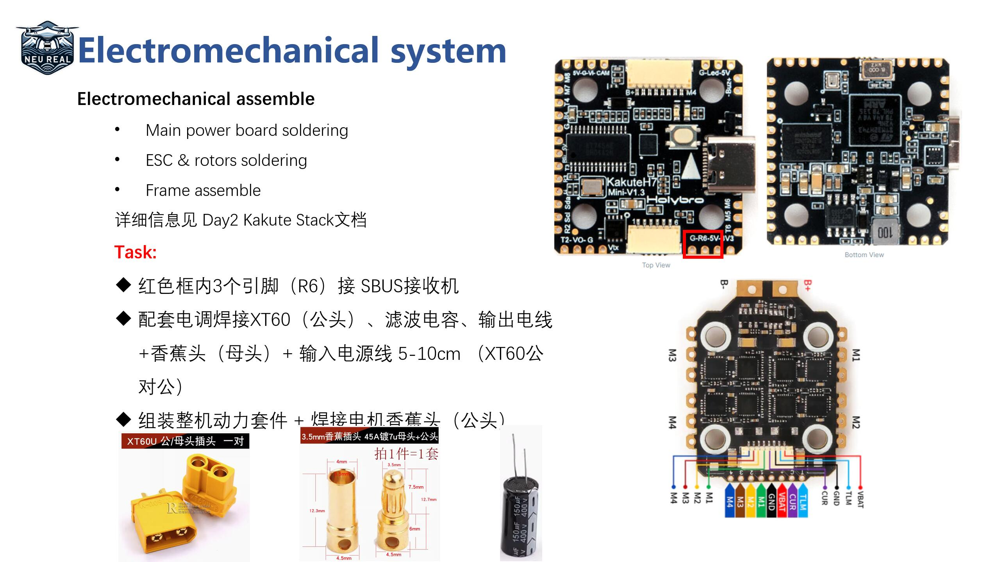
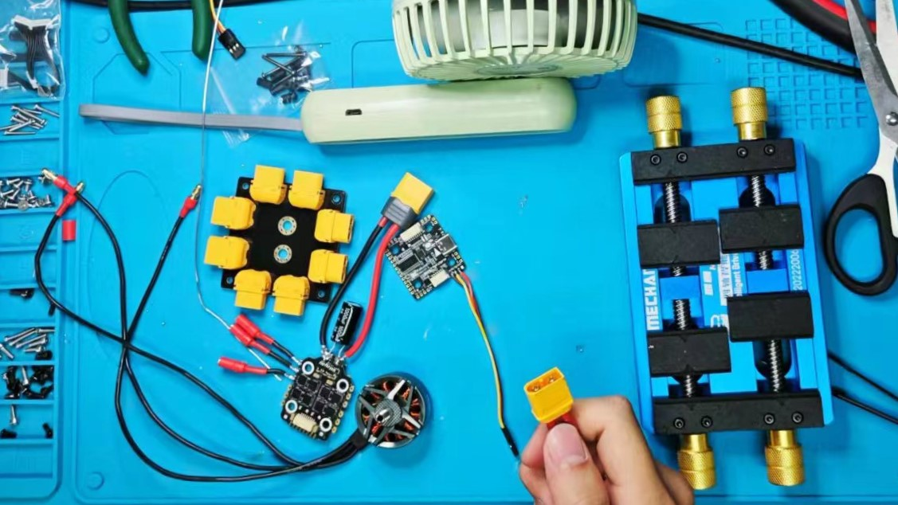
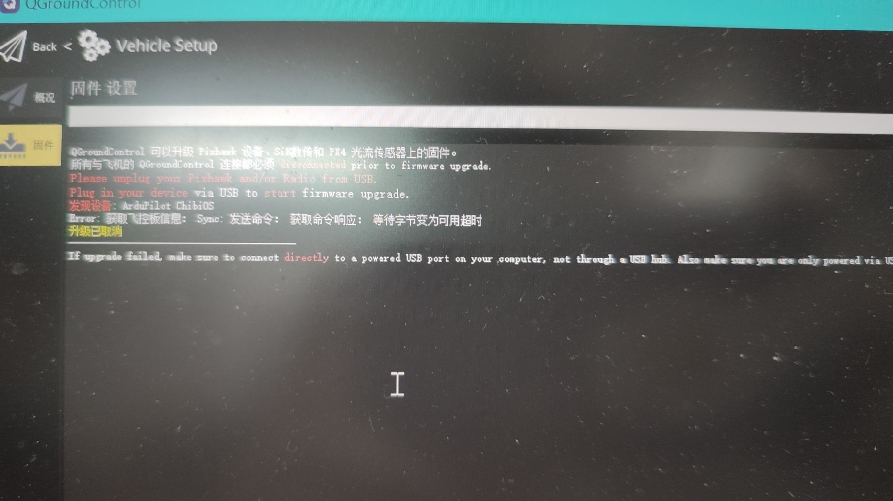
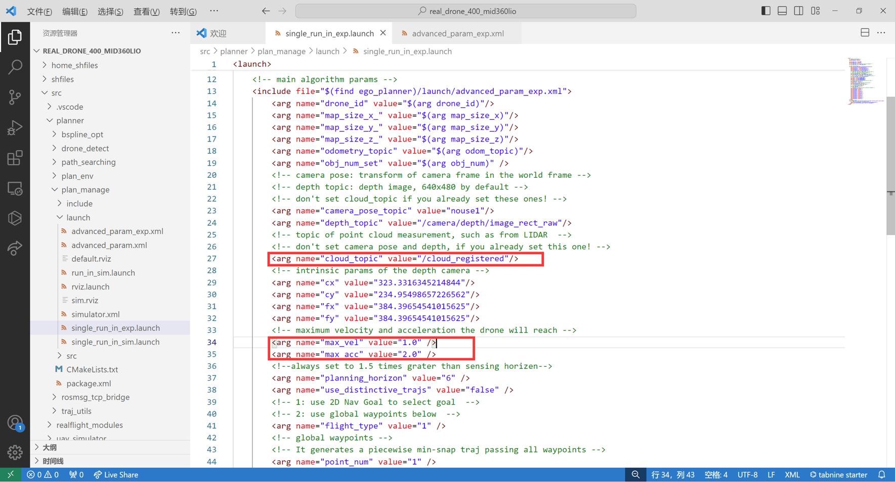
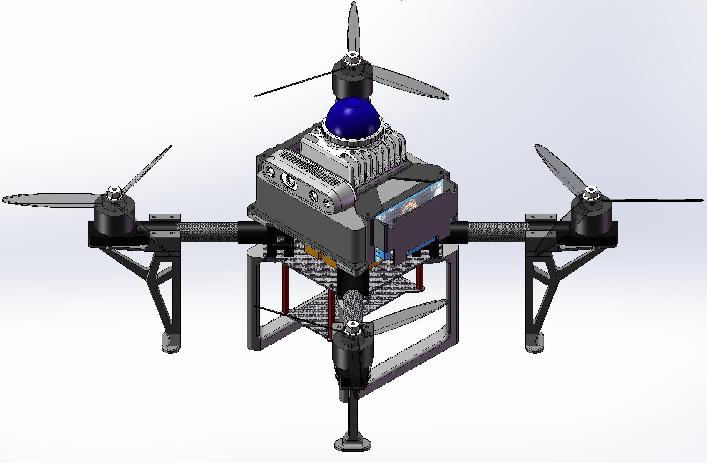
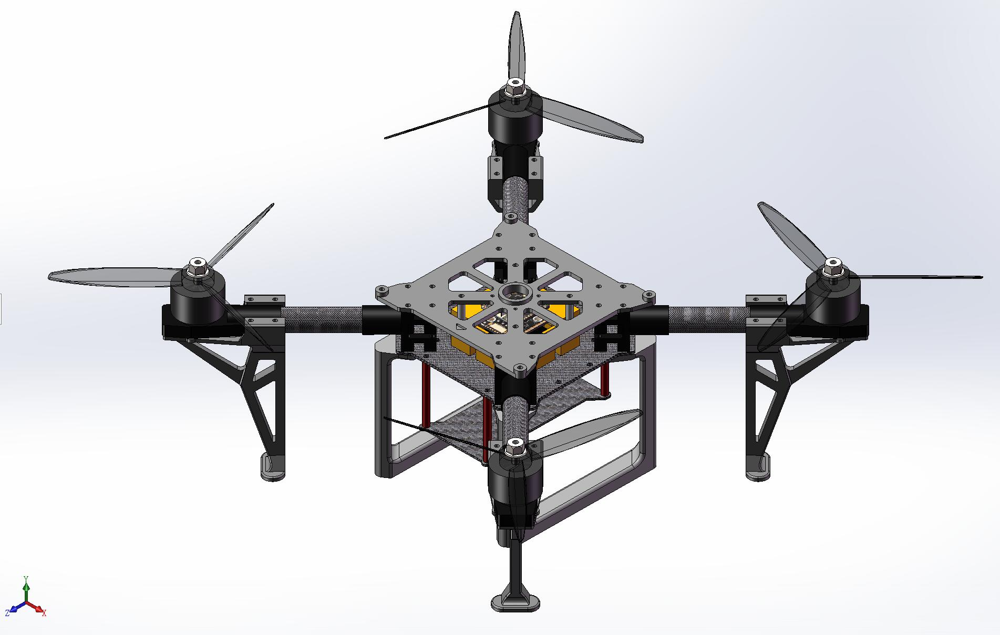
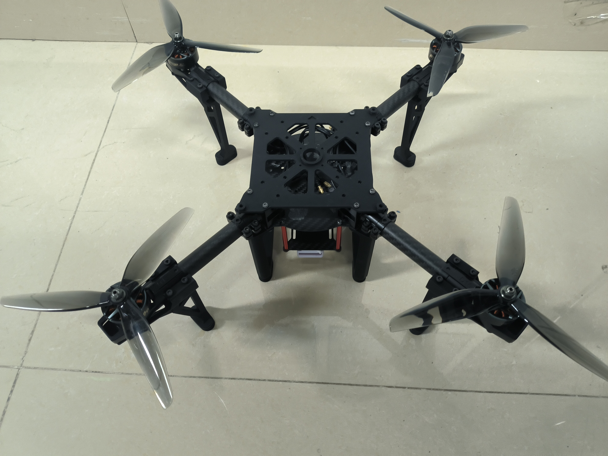
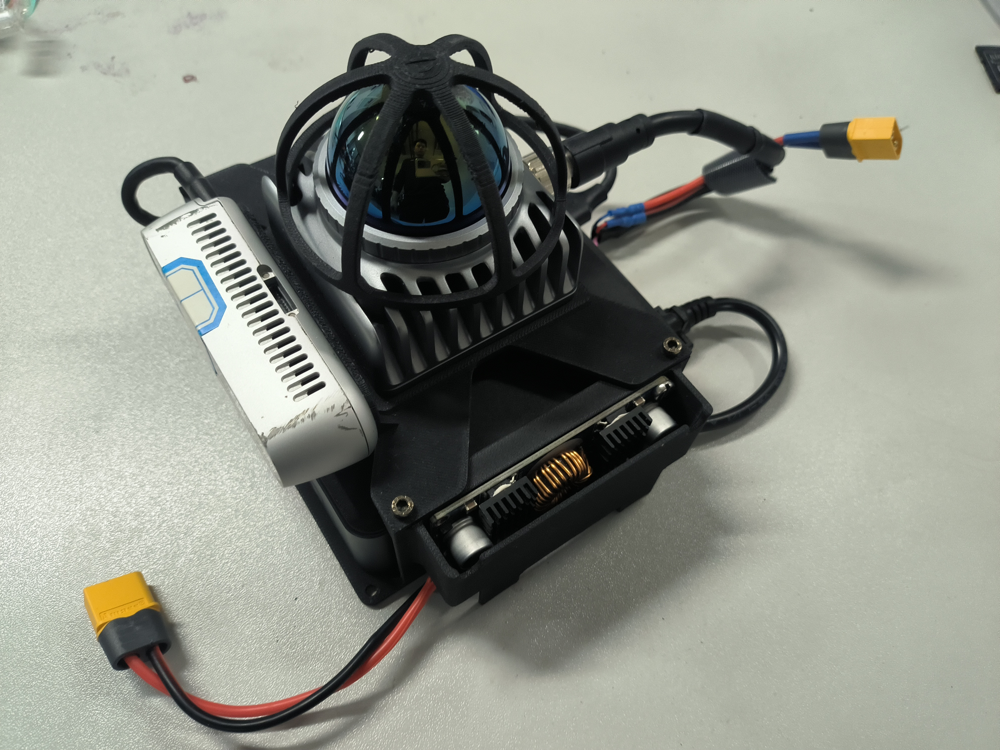
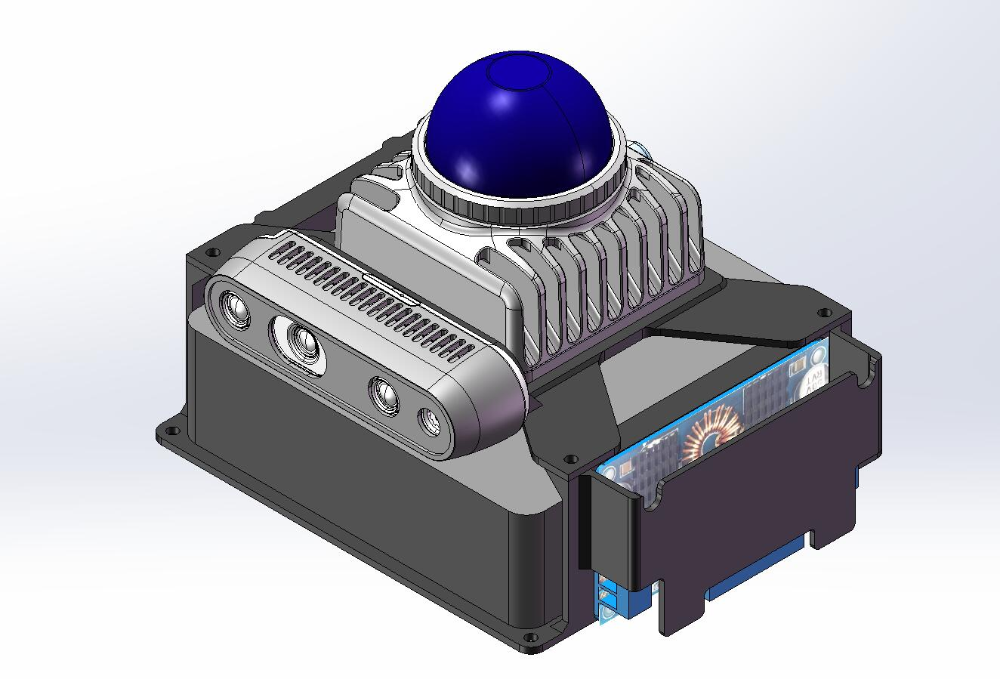

# **【东北大学REAL实验室】自主无人机组装教程** 

Github链接 [REAL_DRONE_400](https://github.com/NEU-REAL/REAL_DRONE_400/) An open source Drone Suite for Aerial Robot.

本文档是视频教程[【东北大学REAL实验室】自主无人机组装教学视频](https://www.bilibili.com/video/BV1hC411H7rh/)的配套文档

实验室主页 [东北大学REAL-LAB 环境感知与自主导航实验室](http://faculty.neu.edu.cn/fangzheng/zh_CN/zdylm/262140/list/index.htm)

  <div align=center>
  
  </div>

⭐项目亮点⭐

⭐结构件 动力套开源

⭐免雷达驱动一键编译

⭐输出高频雷达定位信息。

<font color="#dd0000">**教程简介**</font>

本次课程是一套面向对自主空中机器人感兴趣的学生、爱好者、相关从业人员的免费课程，包含了从硬件组装、代码部署、实机实验等全套详细流程。提供一种Fast-Drone-250的升级大负载能力、稳定定位版本自主无人机。本次课程所涉及的所有代码、硬件设计全部开源。<font color="#dd0000">严禁商用与转载，版权与最终解释权由东北大学REAL实验室所有。</font>

<font color="#dd0000">**安全事项**</font>

四旋翼无人机具有较高的安全风险，请同学们严格遵守安全规范，不要在有人的室内或室外进行试验，对自己和他人的安全负责，本实验室完全免责。

<font color="#dd0000">**致谢**</font>

感谢飞哥组里的小伙伴们提供的支持以及[FAST-DRONE-250开源项目](https://github.com/ZJU-FAST-Lab/Fast-Drone-250)以及[完整课程](https://www.shenlanxueyuan.com/course/385?source=1)。有兴趣的各位可以去点点⭐。

感谢组内指导老师方正教授的大力支持。

感谢一起调试、设计本构型无人机、提供了大力帮助的好伙伴孙哥和白哥。

# 教程视频链接：
- [第一节：无人机简介与电气连接](https://www.bilibili.com/video/BV1hC411H7rh/?vd_source=a901441d2c723973826f98ab4b1463a5)
- [第二节：工作台与焊接讲解](https://www.bilibili.com/video/BV1zC411H7ij/?vd_source=a901441d2c723973826f98ab4b1463a5)
- [第三节：无人机装配与飞控设置](https://www.bilibili.com/video/BV1Nx4y167wC/?vd_source=a901441d2c723973826f98ab4b1463a5)
- [第四节：PX4_Ctrl FSM讲解与真机定点飞行](https://www.bilibili.com/video/BV11i421y7ta/?vd_source=a901441d2c723973826f98ab4b1463a5)
- [第五节：Preception & Planning与真机飞行](https://www.bilibili.com/video/BV1G1421X7sd/?vd_source=a901441d2c723973826f98ab4b1463a5)

# 项目文件说明：
  项目中分为几个文件夹：
- [files](/files/) 文件夹用于存放各类相关文件
- [home_shfiles](/home_shfiles/) 存放了快速启动脚本，请将此目录下的脚本放置于home路径下以快速启动
- [misc](/misc/) 文件夹存放项目相关的图片资料
- [release](/release/) 文件夹存放项目的硬件设计资料，其中[3MF](/release/3MF/)文件夹存放需要打印的部件模型，我们使用拓竹X1C打印机进行3D打印部分材料制作，耗材使用拓竹PLA-CF。[PRODUCTION](/release/PRODUCTION/)文件夹存放可以直接打印的切片工程。[STEP](/release/STEP/)文件夹存放项目相关的所有硬件设计素材，以STEP文件给出。
- [src](/src/) 文件夹放置项目源码文件。

## 第一章：无人机简介与电气连接
  本次课程与高飞老师的[从零制作自主空中机器人](https://www.bilibili.com/video/BV1WZ4y167me?p=1)同样是一套面向对自主空中机器人感兴趣的学生、爱好者、相关从业人员的免费课程，包含了从硬件组装、机载电脑环境设置、代码部署、实机实验等全套详细流程，带你从0开始，组装属于自己的自主无人机，并让它可以在未知的环境中自由避障穿行。本次课程所涉及的所有代码、硬件设计全部开源，<font color="#dd0000">严禁商用与转载，版权与最终解释权由东北大学REAL实验室所有。</font>

  本次课程的重心主要落在自主空中机器人的搭建、代码部署及调试上，关于自主空中机器人的一些理论基础，例如动力学模型，路径搜索，轨迹规划，地图构建等内容，高飞老师在深蓝学院有非常详尽而深入浅出的[课程](https://www.shenlanxueyuan.com/course/385?source=1)，本次课程就不再赘述。


## 第二章：动力套焊接
  机器人本体相关配件及焊接用工具详见[purchase_list.xlsx](files/purchase_list.xlsx)

  **特别强调，四合一电调的输入电源线需要并联配套电解电容，且输入电源线规格至少应在14AWG以上，推荐12AWG与电池一致，保证过流能力！**

  焊接目标如图
  <div align=center>
  
  </div>

  焊接最终结果如图
  <div align=center>
  
  </div>

## 第三章：无人机装配与飞控设置

使用QGC连接飞控，如果无法识别为PX4飞控，例如下图：
  <div align=center>
  
  </div>

请按照以下步骤使用dfu-util 工具在ubuntu下刷飞控bootloader：

1.	长按飞控按钮同时插typec连接电脑，按里面txt的命令，在ubuntu下刷引导进去，注意路径
dfu-util -a 0 --dfuse-address 0x08000000 -D ./holybro_kakuteh7mini_bootloader/holybro_kakuteh7mini_bootloader.bin  

2.	进入qgc的固件界面，再重新插拔，自定义安装压缩包里的px4
再重新插拔应该就有了，这个操作可能会报error，不用管他。

    注意：刷1.14 beta版 
    stable版有bug会导致炸机 Dshot不是很稳定会导致怠速过快
    推荐用PWM400输出电调并调整死区至怠速解锁

* 上电前请先用万用表通断档检测电源正负焊点是否短接，强烈建议第一次上电前先接一个[短路保护器](https://item.taobao.com/item.htm?spm=a230r.1.14.6.72b83b20uNbZk7&id=656973651729&ns=1&abbucket=19#detail)

* <font color="#dd0000">检测电机转向前确保没有安装螺旋桨！！！！</font>

* 修改电机转向：调整转向错误电机的3根连接线中的其中两根交换相接即可。


## 第四章：PX4_Ctrl FSM讲解与真机定点飞行
- 自动起飞与定点控制
```
sh start_sensor.sh；
sh start_mapping.sh；
rostopic echo /Odom_high_freq；
```
拿起飞机进行缓慢的小范围晃动，放回原地后确认没有太大误差；
遥控器5通道拨到内侧，6通道拨到下侧，油门打到中位；
```
sh start_run_ctrl.sh；
sh start_takeoff.sh;
```
如果飞机螺旋桨开始旋转，但无法起飞，说明hover_percent参数过小；如果飞机有明显飞过1米高，再下降的样子，说明hover_percent参数过大；
遥控器此时可以以类似大疆飞机的操作逻辑对无人机进行位置控制；
```
sh start_land.sh
```
降落时把油门打到最低，等无人机降到地上后，把5通道拨到中间，左手杆打到左下角上锁。

## 第五章：Preception & Planning与真机飞行
  确认图中参数：
  <div align=center>
  
  </div>

- Ego-Planner 真机测试

1.启动传感器与定位
```
sh start_sensor.sh；
sh start_mapping.sh；
rostopic echo /Odom_high_freq；
```
2.启动Ego-Planner与Rviz
```
sh start_planner.sh;
sh start_rviz.sh;
```
3.启动PX4_ctrl后确认摇杆正确，自动起飞
```
sh start_run_ctrl.sh；
sh start_takeoff.sh;
```
按下G键加鼠标左键点选目标点使无人机飞行。

4.任务完成后使用自动降落
```
sh start_land.sh；
```

# 合作与维护
我们会努力扩展所提出的系统并提高代码可靠性。持续维护这个项目

如有任何技术问题，请使用此项目的ISSUE功能。

如有商业咨询，请联系东北大学 方正 教授 (fangzheng@mail.neu.edu.cn)。

# 补充说明：
  如果你觉得这个项目对你能够有所帮助，可以点点⭐或者转发分享哦。
  
  附带几组3D设计图与实物图的对照：
  
  1.整机比对
  <div align=center>
  
  
  </div>
  2.动力套件
  <div align=center>
  
  
  </div>
  3.感知模块
  <div align=center>
  
  
  </div>
